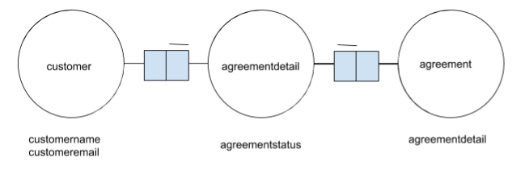

restmode
========

The NIAM diagram of restmode database.

You find the database description here: \
https://github.com/Orathai/restmode/wiki/database-schema

Process from client
-------------------

* INPUT : **deal** (customername, customeremail, dealdetail)
* OUTPUT : **agreementdetail** (id, **customer** , **agreement** , agreementstatus)

References
----------

* `https://spring.io/guides/gs/spring-boot <https://spring.io/guides/gs/spring-boot>`_

Testing application with cURL
-----------------------------
1 : Running application::

     mvn spring-boot:run
     
2 : Running test file AgreementServiceIntegrationTest.java. You can run the test from your IDE, or on your command line     with::

     mvn test -Dtest=AgreementServiceIntegrationTest
     
3 : This creates customer, agreement and agreementdetail, which is contains id, customer , agreement and agreementstatus. Then you can do::

     #curl -s http://localhost:9000/customers
      {
       "customerEmail": "p@p.com",
       "customerName": "Peter Pan",
       "id": 4
      }
      #curl -s http://localhost:9000/agreements
      [{
        "agreementDetail": "Vacation Loan",
        "id": 3
      }]

      #curl -s http://localhost:9000/agreementdetails
      [
        ...

        {
          "agreementStatus": "SENT_TO_CUSTOMER",
          "agreementModel": {
            "agreementDetail": "Vacation Loan",
            "id": 3
          },
          "customerModel": {
            "customerEmail": "p@p.com",
            "customerName": "Peter Pan",
            "id": 4
          },
          "id": 10
        }
        ...
      ]

